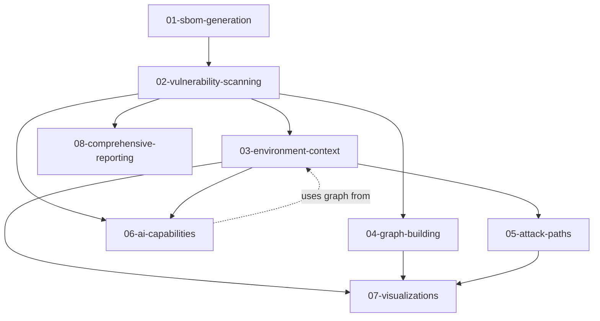

# Threat Radar Demo Scripts - Quick Index

## 📑 Script Inventory

### Enterprise Multi-Service Analysis

| # | Script | Feature | Duration | Prerequisites | Results Dir |
|---|--------|---------|----------|---------------|-------------|
| 0 | `00-run-all-services.sh` | **Complete 12-service analysis** | 15-20 min | None | `full-demo-results/` |

**⭐ NEW:** Run comprehensive analysis across all 12 microservices! See [RUNNING_ALL_SERVICES.md](RUNNING_ALL_SERVICES.md) for details.

### Individual Service Demos (Deep-Dive)

| # | Script | Feature | Duration | Prerequisites | Results Dir |
|---|--------|---------|----------|---------------|-------------|
| 1 | `01-sbom-generation.sh` | SBOM generation | 4-5 min | None | `demo-01-results/` |
| 2 | `02-vulnerability-scanning.sh` | CVE scanning | 2-3 min | None | `demo-01-results/` |
| 3 | `03-environment-context.sh` | Business context | 5-6 min | Demo 2 (auto-runs) | `demo-06-results/` |
| 4 | `04-graph-building.sh` | Graph database | 3-4 min | Demo 2 (auto-runs) | `demo-04-results/` |
| 5 | `05-attack-paths.sh` | Attack paths | 6-8 min | Demo 3 | `demo-07-results/` |
| 6 | `06-ai-capabilities.sh` | AI analysis | 5-10 min | AI provider, Demo 2 | `demo-05-results/` |
| 7 | `07-visualizations.sh` | Visualizations | 4-5 min | Plotly, Demos 3/4/5 | `demo-08-results/` |
| 8 | `08-comprehensive-reporting.sh` | Reporting | 4-5 min | Demo 2 (auto-runs) | `demo-04-results/` |

**Note:** Result directories don't always match demo numbers due to workflow optimization. See Results Storage section below for details.

## 🎯 Quick Command Reference

```bash
# Navigate to demos
cd examples/microservices-demo-analysis/demo-scripts

# ⭐ NEW: Run complete multi-service analysis (all 12 services)
./00-run-all-services.sh

# With visualizations enabled
RUN_VISUALIZATIONS=true ./00-run-all-services.sh

# Run individual demo (deep-dive for one service)
./01-sbom-generation.sh

# Run specific sequence
./02-vulnerability-scanning.sh
./03-environment-context.sh
./05-attack-paths.sh

# Clean up results (be careful!)
rm -rf demo-*-results/ full-demo-results/
```

## ✅ Features Demonstrated

### Core Scanning & Detection
- ✅ **SBOM Generation** (`sbom docker`, `sbom read`, `sbom compare`, `sbom export`)
- ✅ **CVE Vulnerability Scanning** (`cve scan-image`)
- ✅ **Environment Configuration** (`env validate`, `env build-graph`)
- ✅ **Graph Building** (`graph build`, `graph query`, `graph fixes`)

### Attack Surface Analysis
- ✅ **Attack Path Discovery** (`graph attack-paths`)
- ✅ **Privilege Escalation Detection** (`graph privilege-escalation`)
- ✅ **Lateral Movement Analysis** (`graph lateral-movement`)
- ✅ **Attack Surface Mapping** (`graph attack-surface`)

### AI-Powered Analysis
- ✅ **Vulnerability Analysis** (`ai analyze` with batch processing)
- ✅ **Priority Ranking** (`ai prioritize`)
- ✅ **Remediation Guidance** (`ai remediate`)
- ✅ **Business Context Analysis** (`ai analyze-with-context`)
- ✅ **Threat Modeling** (`ai threat-model`)

### Visualization & Reporting
- ✅ **Interactive Graph Viz** (`visualize graph`)
- ✅ **Attack Path Viz** (`visualize attack-paths`)
- ✅ **Network Topology Viz** (`visualize topology`)
- ✅ **Comprehensive Reports** (`report generate` - HTML, JSON, Markdown)
- ✅ **Dashboard Export** (`report dashboard-export`)
- ✅ **Multiple Report Levels** (executive, summary, detailed, critical-only)

### Integration Features
- ✅ **AI Provider Support** (OpenAI, Anthropic, Ollama)
- ✅ **Auto-save to Storage** (`--auto-save` flag)
- ✅ **Batch Processing** (large CVE scans, 100+ vulnerabilities)
- ✅ **Business Context Integration** (criticality, compliance, data classification)
- ✅ **Graph Validation** (data quality checks)

## 🚫 Features Available But Not Demonstrated

### Additional Commands
- ❌ **SBOM Components** (`sbom components` - filter/group by type, language)
- ❌ **SBOM Search** (`sbom search` - search for specific packages)
- ❌ **SBOM Statistics** (`sbom stats` - detailed package statistics)
- ❌ **SBOM List** (`sbom list` - list all stored SBOMs)
- ❌ **CVE Directory Scanning** (`cve scan-directory` - scan local code)
- ❌ **CVE SBOM Scanning** (`cve scan-sbom` - scan pre-generated SBOMs)
- ❌ **CVE Database Management** (`cve db-update`, `cve db-status`)
- ❌ **Docker Analysis** (`docker import-image`, `docker scan`, `docker packages`)
- ❌ **Docker Python SBOM** (`docker python-sbom` - Python-specific analysis)
- ❌ **Graph List** (`graph list` - list stored graphs)
- ❌ **Graph Info** (`graph info` - graph metadata)
- ❌ **Graph Cleanup** (`graph cleanup` - remove old graphs)
- ❌ **Visualization Filtering** (`visualize filter` - filter by severity, CVE, package, zone)
- ❌ **Visualization Export** (`visualize export` - PNG, SVG, PDF, DOT, GEXF, Cytoscape)
- ❌ **Visualization Stats** (`visualize stats` - filter value statistics)
- ❌ **Report Comparison** (`report compare` - track changes over time)
- ❌ **Configuration Management** (`config show`, `config set`, `config init`, `config validate`)
- ❌ **File Hashing** (`hash` - integrity verification)
- ❌ **Health Check** (`health` - system status)

### Advanced Features
- ❌ **3D Visualizations** (`--3d` flag)
- ❌ **Custom Layouts** (kamada_kawai, spectral)
- ❌ **Severity Filtering** (`--severity` for AI analysis)
- ❌ **PDF Reports** (`-f pdf` format)
- ❌ **YAML Output** (`-f yaml` format)
- ❌ **CSV Output** (`-f csv` format)
- ❌ **Global Config File** (`--config` flag)
- ❌ **Verbosity Levels** (`-v`, `-vv`, `-vvv`, `-q`)
- ❌ **Image Cleanup** (`--cleanup` after scan)
- ❌ **Custom AI Models** (different model selection)
- ❌ **OpenRouter Integration** (multi-provider AI access)
- ❌ **No Progress Mode** (`--no-progress` for CI/CD)

### Use Cases Not Shown
- ❌ **CI/CD Integration** (GitHub Actions, Jenkins pipelines)
- ❌ **Trend Analysis** (comparing scans over time)
- ❌ **Multi-Image Scanning** (scanning entire stack at once)
- ❌ **Compliance Reporting** (PCI-DSS, HIPAA, SOX specific reports)
- ❌ **Custom Dashboard Integration** (Grafana, Splunk, ELK)
- ❌ **Automated Reporting** (cron jobs, scheduled scans)
- ❌ **SBOM Comparison Workflows** (tracking dependency changes)

## 🎬 Demo Sequences by Audience

### For Technical Audience (Security Engineers)
```bash
./02-vulnerability-scanning.sh # Vulnerability discovery
./04-graph-building.sh         # Relationship analysis
./06-ai-capabilities.sh        # Intelligent prioritization
./05-attack-paths.sh           # Exploitation routes
```
**Total time**: ~18-25 minutes

### For Executive Audience (CTO, CISO)
```bash
./02-vulnerability-scanning.sh # What are we scanning
./03-environment-context.sh    # Business impact
./05-attack-paths.sh           # Real-world risk
./08-comprehensive-reporting.sh # Executive summary
```
**Total time**: ~17-22 minutes

### For DevOps/Development Teams
```bash
./01-sbom-generation.sh        # Dependency tracking
./02-vulnerability-scanning.sh # Find vulnerabilities
./06-ai-capabilities.sh        # Fix recommendations
./08-comprehensive-reporting.sh # CI/CD integration
```
**Total time**: ~15-23 minutes

### For Compliance/Audit
```bash
./01-sbom-generation.sh        # SBOM requirements
./03-environment-context.sh    # Compliance scope
./08-comprehensive-reporting.sh # Audit reports
```
**Total time**: ~13-16 minutes

## 📊 Feature Coverage Matrix

| Feature Category | Demo # | Commands Shown | Output Types | Results Dir |
|-----------------|--------|----------------|--------------|-------------|
| **SBOM** | 1 | `sbom docker`, `read`, `compare`, `export` | JSON, CSV | `demo-01-results/` |
| **CVE Scanning** | 2 | `cve scan-image` | JSON | `demo-01-results/` |
| **Environment** | 3 | `env validate`, `build-graph` | GraphML, JSON | `demo-06-results/` |
| **Graph** | 4 | `graph build`, `query`, `fixes` | GraphML | `demo-04-results/` |
| **Attack Paths** | 5 | `graph attack-paths`, `privilege-escalation`, `lateral-movement`, `attack-surface` | JSON | `demo-07-results/` |
| **AI** | 6 | `ai analyze`, `prioritize`, `remediate`, `analyze-with-context`, `threat-model` | JSON | `demo-05-results/` |
| **Visualization** | 7 | `visualize graph`, `attack-paths`, `topology` | HTML | `demo-08-results/` |
| **Reporting** | 8 | `report generate`, `dashboard-export` | HTML, MD, JSON | `demo-04-results/` |

## 🎤 One-Liner Summaries (for quick introductions)

1. **SBOM Generation**: "Create software bill of materials for supply chain transparency and dependency tracking"
2. **CVE Scanning**: "Find all known vulnerabilities in Docker images using Grype with zero API rate limits"
3. **Environment Context**: "Add business criticality, compliance requirements, and risk tolerance to technical vulnerability data"
4. **Graph Analysis**: "Model vulnerability relationships for blast radius analysis and fix impact assessment"
5. **Attack Paths**: "Discover real-world exploitation routes from internet-facing entry points to critical business assets"
6. **AI Analysis**: "Use large language models to prioritize vulnerabilities, generate remediation plans, and model threats"
7. **Visualizations**: "Create interactive, web-based explorations of vulnerability graphs and network topology"
8. **Comprehensive Reporting**: "Generate multi-format reports (HTML, PDF, Markdown, JSON) for different audiences with AI summaries"

## 💾 Results Storage

Demo scripts use optimized result directories that don't always match demo numbers:

```
demo-scripts/
├── demo-01-results/    # SBOMs + CVE scans (from demos 1 & 2)
│   ├── *_sbom.json
│   ├── *_scan.json
│   └── *.csv
│
├── demo-04-results/    # Graphs + Reports (from demos 4 & 8)
│   ├── vulnerability-graph.graphml
│   ├── *_report.html
│   ├── *_report.md
│   └── *_dashboard.json
│
├── demo-05-results/    # AI analysis (from demo 6)
│   ├── *_analysis.json
│   ├── *_priorities.json
│   ├── *_remediation.json
│   ├── *_business_analysis.json
│   └── *_threat_model.json
│
├── demo-06-results/    # Environment config (from demo 3)
│   ├── production-environment.json
│   └── infrastructure-graph.graphml
│
├── demo-07-results/    # Attack paths (from demo 5)
│   ├── attack-paths.json
│   ├── privilege-escalation.json
│   ├── lateral-movement.json
│   └── attack-surface.json
│
└── demo-08-results/    # Visualizations (from demo 7)
    ├── graph-viz.html
    ├── attack-paths-viz.html
    ├── topology-viz.html
    └── *.png (optional)
```

**Rationale for directory naming:**
- `demo-01-results/` - Shared by demos 1 & 2 (both create scan/SBOM data)
- `demo-04-results/` - Shared by demos 4 & 8 (graphs and reports)
- Result dirs named after first demo that populates them
- Allows demos to reference each other's output efficiently

## 🔄 Demo Dependencies



**Key:**
- Solid arrows: Auto-runs prerequisite if needed
- Dotted arrows: Optional enhancement if available

## ⚙️ Setup Checklist

Before running demos:

**Required:**
- [ ] Threat Radar installed (`threat-radar --help` works)
- [ ] Grype installed (`grype version` works)
- [ ] Docker running (`docker ps` works)
- [ ] jq installed (`jq --version` works)
- [ ] In correct directory (`cd demo-scripts/`)

**Optional for enhanced demos:**
- [ ] AI provider configured (`.env` file with `AI_PROVIDER`, `AI_MODEL`, API keys)
- [ ] Plotly installed (`pip install plotly`) for visualizations
- [ ] Kaleido installed (`pip install kaleido`) for PNG/PDF viz export
- [ ] WeasyPrint installed (`pip install weasyprint`) for PDF reports

**Environment variables (.env file):**
```bash
# AI Configuration (required for demo 6)
AI_PROVIDER=anthropic          # or openai, ollama, openrouter
AI_MODEL=claude-3-5-sonnet-20241022  # or gpt-4o, llama2, etc.
ANTHROPIC_API_KEY=sk-ant-...  # or OPENAI_API_KEY, OPENROUTER_API_KEY
```

## 🎯 Common Demo Patterns

### Pattern 1: Quick Overview (5 minutes)
```bash
./02-vulnerability-scanning.sh
# Show vulnerability counts, explain scan process
```

### Pattern 2: Full Feature Tour (20 minutes)
```bash
./02-vulnerability-scanning.sh
./04-graph-building.sh
./08-comprehensive-reporting.sh
./03-environment-context.sh
```

### Pattern 3: AI Showcase (15 minutes)
```bash
./02-vulnerability-scanning.sh
./06-ai-capabilities.sh
# Focus on AI remediation guidance and threat modeling
```

### Pattern 4: Attack Surface Deep Dive (25 minutes)
```bash
./02-vulnerability-scanning.sh
./03-environment-context.sh
./05-attack-paths.sh
./07-visualizations.sh
```

### Pattern 5: Business Risk Assessment (18 minutes)
```bash
./02-vulnerability-scanning.sh
./03-environment-context.sh
./06-ai-capabilities.sh  # Step 4: Business Context Analysis
./08-comprehensive-reporting.sh  # Executive report
```

## 📝 Presentation Notes

### Opening Hook (1 minute)
"We're analyzing Google's microservices-demo - a production-grade e-commerce application with 11 services. Let's see what Threat Radar finds and, more importantly, what it means for your business..."

### Key Stats to Highlight
- **Services scanned**: 12 microservices
- **Total vulnerabilities**: 37 in paymentservice alone
- **Critical CVEs**: 2 critical, 11 high severity
- **Languages analyzed**: Node.js, Python, Go, Java, C#, Redis
- **Attack paths discovered**: Multiple routes from DMZ to PCI-scoped assets
- **Business context**: PCI-DSS compliance scope tracked

### Wow Moments

1. **Graph blast radius** (Demo 4):
   - "This one CVE affects 5 different packages across multiple services"
   - Show package vulnerability propagation

2. **AI prioritization** (Demo 6):
   - "AI ranks paymentservice CVE as CRITICAL due to PCI scope and business impact"
   - Show business context-aware risk scoring

3. **Attack paths** (Demo 5):
   - "Here's how an attacker could reach the payment API from the public frontend in just 2 steps"
   - Show privilege escalation from DMZ → Internal zone

4. **Interactive visualization** (Demo 7):
   - "Click any node to explore its vulnerabilities, hover for CVSS scores"
   - Show network topology with security zones

5. **AI remediation** (Demo 6):
   - "AI generates specific upgrade commands: `apk upgrade libcrypto3=3.3.3-r0`"
   - Show effort estimates and testing steps

6. **Executive summary** (Demo 8):
   - "AI-generated summary in plain English for C-suite executives"
   - Show dashboard metrics and recommendations

## 🏁 Closing Summary

After demos, emphasize:

### **Automation**
- All commands can run in CI/CD pipelines (GitHub Actions, Jenkins)
- `--auto-save` flag for persistent storage
- `--no-progress` for non-interactive environments
- `--quiet` for script-friendly output

### **Integration**
- Works with existing tools (Grype, Syft, Docker)
- Exports to Grafana, Splunk, ELK via JSON
- GraphML compatible with Gephi, Neo4j, NetworkX
- Supports OpenAI, Anthropic, Ollama, OpenRouter

### **Intelligence**
- AI-powered insights, not just raw data
- Business context-aware prioritization
- Threat modeling with realistic attack scenarios
- Remediation guidance with specific commands

### **Business Focus**
- Technical severity + business criticality = true risk
- Compliance scope tracking (PCI-DSS, GDPR, HIPAA)
- Cost estimates for breaches and downtime
- SLA-driven remediation timelines

### **Scalability**
- Batch processing for 100+ CVEs
- Enterprise-wide graph consolidation
- Multi-service attack path analysis
- Historical trend tracking via report comparison

---

## 📚 Additional Resources

**Quick Start**: Run `./02-vulnerability-scanning.sh` for a 3-minute intro

**Full Documentation**:
- Main project: `/Users/chemch/PycharmProjects/tr-m2/CLAUDE.md`
- CLI features: `/Users/chemch/PycharmProjects/tr-m2/docs/CLI_FEATURES.md`
- API reference: `/Users/chemch/PycharmProjects/tr-m2/docs/API.md`
- Installation: `/Users/chemch/PycharmProjects/tr-m2/INSTALLATION.md`

**Support & Troubleshooting**:
- Examples: `/Users/chemch/PycharmProjects/tr-m2/examples/`
- Issues: GitHub repository issues page
- Configuration: `.env.example` in project root

**Sample Outputs**:
All demo result directories contain example outputs you can reference without running the demos.
